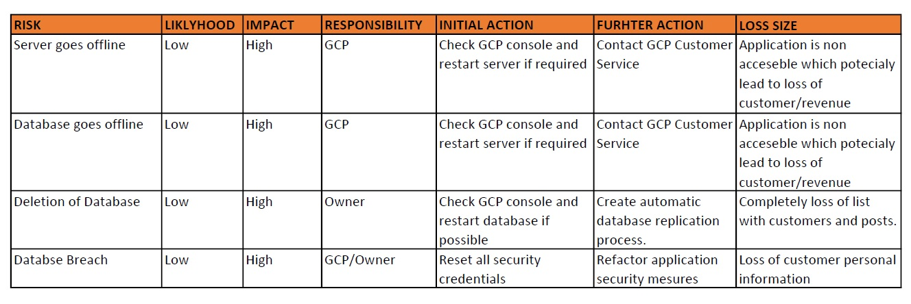

# Nickname Generator

https://github.com/tadasbytautas/tadasSFIA2

## Contents

- Project Objective
- Application Overview
- Trello Board
- Tech Stack
- Git Branch Logs
- Database Table
- CI Pipeline
- Application Design
- Deployment 
- Risk Assessment
- Outstanding Issues
- Improvements
- Author

## Project Objective

The requirements of the project are as follows:
- An Asana board (or equivalent Kanban board tech) with full expansion on tasks needed to complete the project. 
- An Application fully integrated using the Feature-Branch model into a Version Control System which will subsequently be built through a CI server and deployed to a cloud-based virtual machine. 
- If a change is made to a code base, then Webhooks should be used so that Jenkins recreates and redeploys the changed application. 
- The project must follow the Service-oriented architecture that has been asked for. 
- The project must be deployed using containerisation and an orchestration tool.
- As part of the project, you need to create an Ansible Playbook that will provision the environment that your application needs to run. 
- The project must make use of a reverse proxy to make your application accessible to the user. 

  
## Application Overview
Application designed to create random nickname witch ustualised 4 different microservices.   

Service 1 - is purely designed for user who using application. User has ability to create new nickname by pressing **Generate Nickname** button and see other nickanames that were generetrated previously.

Service 2 - backend service which generates first part of the nickname. Application choses one random string out of 9 which will be used as part of full nickname.

Service 3 - another backend service which does almost same as Service 2, only difference its genererating second part of the nickname.

Service 4 - Combines output of Service 2 and Service 3. Service 1 sends GET request to Service 4 and represens outcome to the user on the main page.

<br>


## Trello Board

https://trello.com/b/I941VP4w/sfia2

For tracking project progress Trello board was used. Trello is free tool which I utilised for SFIA1 project therefor it made sense to use it again. Picture below was taken at the beginning of the project.


Second picture was taken towards end of SFIA2 project which changed quite a bit. MSCW principle was used to make sure application has all core functionaly as per project requirements. Personaly found no use to use sprints in this project as development process was done in paralel while doing training. 


## Tech Stack

- Trello - Project Management
- Git / GitHub - Version Control System
- Google Cloud MySQL - Hosting Database
- Google Cloud WM - Hosting Linux Ubuntu Instance
- Docker - Conternisasion
- Docker Swarm - Orchestration
- Ansible - Configuration Management
- Nginx - Web Server Functionality
- Jenkins - Continues Integration Pipeline
- Python 3 - Backend Functionality
- Bootstrap 4 - Minimal Frontend Styling

## Git Branch Logs


## Database
One of the application requirements was to make sure data is persistent, for this MySQL virtual machine was used. Simple table nickname_gen was created and utilised for this task. 


## CI Pipeline  

First Diagriam represnts idea of first implementation of CI pipeline prior project development stage. 


Second diagram is focused more on SFIA2 end cicle of finished product. CI pipeline now has Ansible as configaration management tool and docker swarm as orchestrator.


##  Application Design 

Application is quite simple design wise. Title of application is on the top, recentrly generated nickname visable between title and genreate nickname button and previously genererated nicknames populated below in descending order.


## Deployment

The deployment of the application is fully automated by uttilising tools such as Jenkins, Ansible and Docker. As soon as code being pushed to github repository Jenkins pull the code and starts building docker images. This process is already preconfigured in a way that user should not be required to do any manual work.

Process of Deployment:

- Jenkins builds docker images of each microservice and pushes them to docker hub account.
- Ansible playbook is being run which checks if docker is installed on manager and worker node, initiciates docker swarm if applicable. Removes unused images/containers/networks on manager and worker nodes.
- Docker deploys application using docker compose. Configuration is preconfigured is such way that each image of each microservice and nginx would be deployed on the same network. For redundency and seemingless updates 3 replicas of each microservice being created.
- Lastly for seemless update, docker pull fresh images from docker hub and updated current setup if any changes were done. Earlier generated 3 replicas of each microservice allow images being updated one by one which provides virtually no downtime for the user.  


Failed builds due to errors in code or logical mistakes.


## Risk Assessment 



## Outstanding Issues

- Docker Swarm Manager and Worker nodes have already have dependencies preinstalled therefor if deployed on entirely new enviroment sometimes deploying application can leed to unwanted results.
- In some cases Ansible skipping removing unused images on worker node. 

## Future Improvements

 - Adding some CSS would make application more eye catching.
 - More rigurous testing would serve beficial for overall health of applciation. 
 - Reconfiguration of Ansible would be advisible to make sure it fully suport ``` docker system prune ``` for worker node.

 ## Author

 #### Tadas Bytautas - QA DevOps and Cloud Consultant