# Nickname Generator

https://github.com/tadasbytautas/tadasSFIA2

## Contents

- Project Objective
- Application Overview
- Trello Board
- Tech Stack
- Git Branch Logs
- Database Table
- CI Pipeline
- Application Design
- Deployment 
- Risk Assessment
- Outstanding Issues
- Improvements
- Retrospective
- Author

## Project Objective

The requirements of the project are as follows:
- An Asana board (or equivalent Kanban board tech) with full expansion on tasks needed to complete the project. 
- An Application fully integrated using the Feature-Branch model into a Version Control System which will subsequently be built through a CI server and deployed to a cloud-based virtual machine. 
- If a change is made to a code base, then Webhooks should be used so that Jenkins recreates and redeploys the changed application. 
- The project must follow the Service-oriented architecture that has been asked for. 
- The project must be deployed using containerisation and an orchestration tool.
- As part of the project, you need to create an Ansible Playbook that will provision the environment that your application needs to run. 
- The project must make use of a reverse proxy to make your application accessible to the user. 

  
## Application Overview

Application designed to create random nickname which utilised 4 different microservices.   

Service 1 - is purely designed for user who using application. User has ability to create new nickname by pressing **Generate Nickname** button and see other nicknames that were generated previously.

Service 2 - backend service which generates first part of the nickname. Application choses one random string out of 9 which will be used as part of full nickname.

Service 3 - another backend service which does almost same thing as Service 2, only difference its generating second part of the nickname.

Service 4 - Combines output of Service 2 and Service 3. Service 1 sends GET request to Service 4 and returns combination to the user on the main page.

<br>

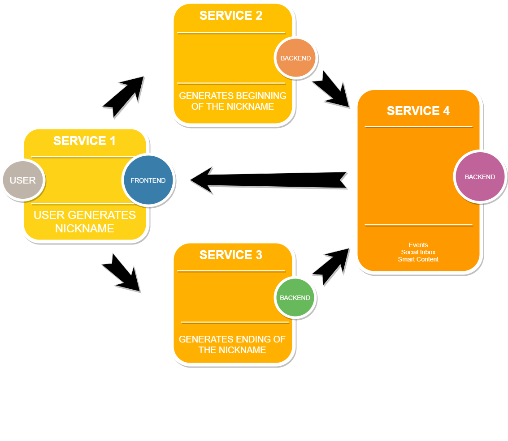


## Trello Board

https://trello.com/b/I941VP4w/sfia2

For tracking project progress Trello board was used. Trello is free tool which I utilised for SFIA1 project therefore it made sense to use it again. Picture below was taken at the beginning of the project.

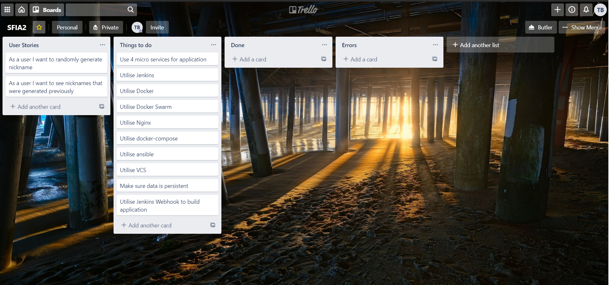

Second picture was taken towards end of SFIA2 project which changed quite a bit. MSCW principle was used to make sure application has core functionaly as per project requirements. Personally found no use to use sprints in this project as development process was done in parallel while doing training and new technologies were added on the fly. 

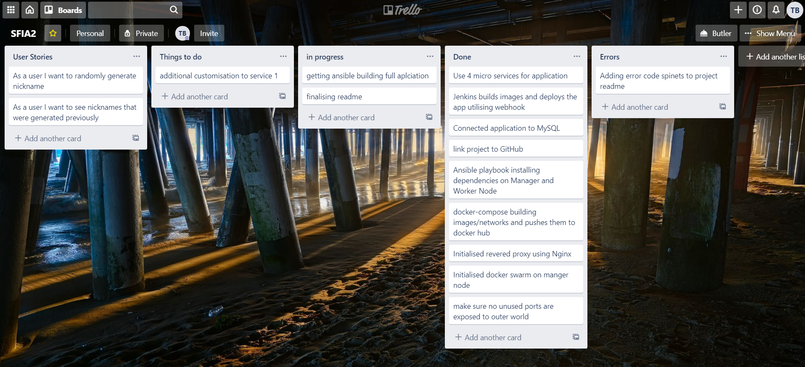

## Tech Stack

- Trello Board - Project Management
- Git / GitHub - Version Control System
- Google Cloud MySQL - Hosting Database
- Google Cloud WM - Hosting Linux Ubuntu Instance
- Docker - Containerisation
- Docker Swarm - Orchestration
- Ansible - Configuration Management
- Nginx - Web Server Functionality
- Jenkins - Continues Integration Pipeline
- Python 3 - Backend Functionality
- Bootstrap 4 - Minimal Frontend Styling

## Git Branch Logs

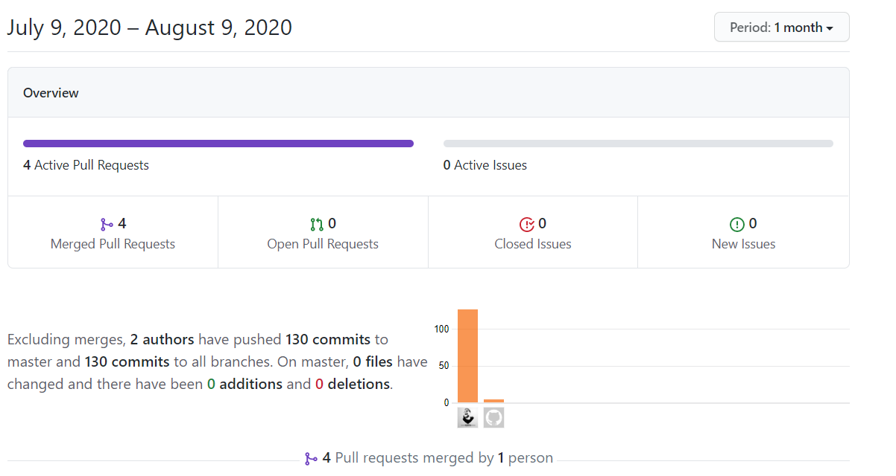

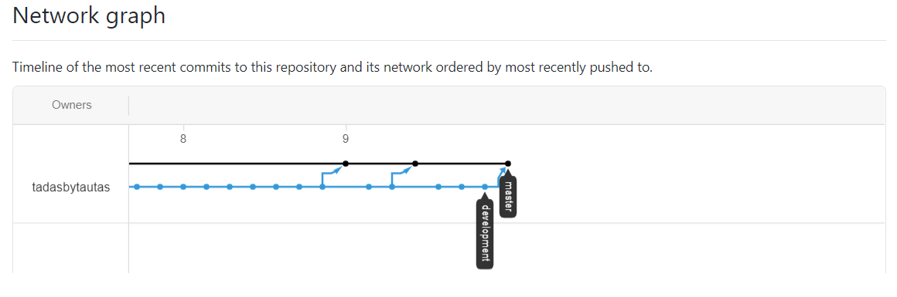

## Database
One of the application requirements was to make sure data is persistent, for this MySQL database was used. Simple table nickname_gen was created and utilised for this task. 

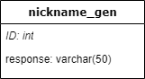

## CI Pipeline  

First diagram represents idea of first implementation of CI pipeline prior project development stage. 


Second diagram is focused more on SFIA2 end cicle of finished product. CI pipeline now has Ansible as configuration management tool and docker swarm as orchestrator.

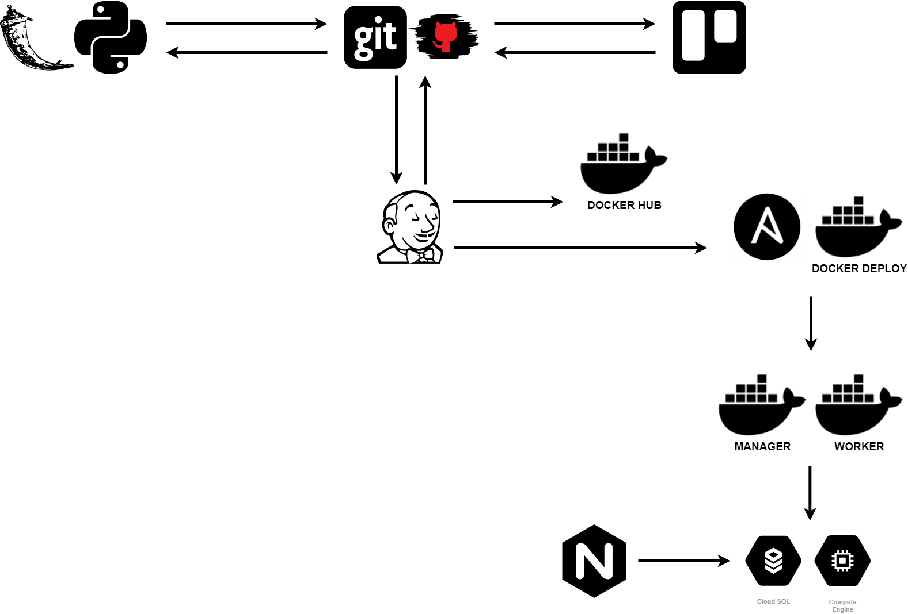

##  Application Design 

Application is quite simple design wise. Title of application is on the top, recently generated nickname visible between title and generate nickname button and previously generated nicknames populated below in descending order.

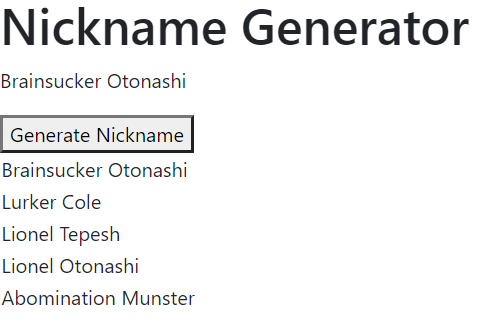

## Deployment

The deployment of the application is fully automated by utilising tools such as Jenkins, Ansible and Docker. As soon as the code being pushed to github repository Jenkins pulls the code from the same repository using webhook and starts building docker images. This process has been already preconfigured in a way that users should not be required to do any manual work.

Process of Deployment:

- Jenkins builds docker images of each microservice and pushes them to docker hub account.
- Ansible playbook is being run which checks if docker is installed on Manager and Worker node, initiciates docker swarm if applicable. Removes unused images/containers/networks on manager and worker nodes.
- Docker deploys application utilising docker-compose. Configuration is preconfigured is such way that each image of each microservice and nginx would be deployed on the same network. For redundancy and seaming less updates 3 replicas of each microservice are being created.
- Lastly for seamless update, docker pulls fresh images from docker hub and updates current setup if any changes were done. Earlier generated 3 replicas of each microservice allow images being updated one by one which provides virtually no downtime for the user however some old content can be visible for short period of time.  

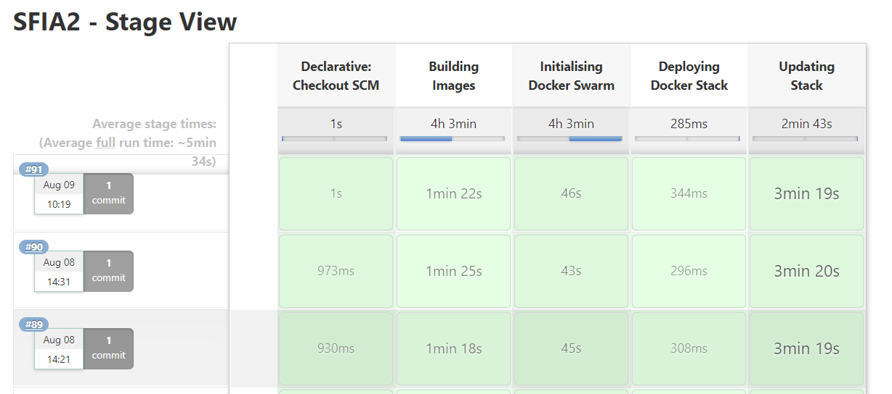

Failed builds due to errors in code or logical mistakes.

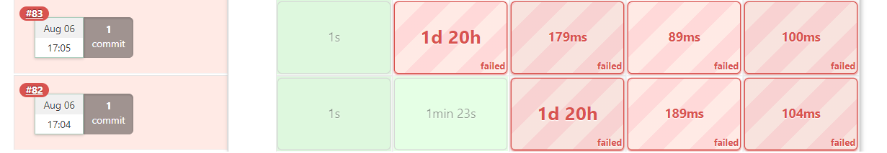

Some examples of encountered errors that were causing builds to fail.

```
wrapper script does not seem to be touching the log file in /var/lib/jenkins/workspace/SFIA2@2@tmp/durable-0abb33fa
(JENKINS-48300: if on an extremely laggy filesystem, consider -Dorg.jenkinsci.plugins.durabletask.BourneShellScript.HEARTBEAT_CHECK_INTERVAL=86400)
```

```
TASK [docker-swarm-init : Docker Prune] ****************************************
fatal: [localhost]: FAILED! => {"changed": false, "msg": "name or hostname arg needs to be provided"}

NO MORE HOSTS LEFT *************************************************************
	to retry, use: --limit @/var/lib/jenkins/workspace/SFIA2/playbook.retry

PLAY RECAP *********************************************************************
localhost                  : ok=13   changed=7    unreachable=0    failed=1   
```

## Risk Assessment 

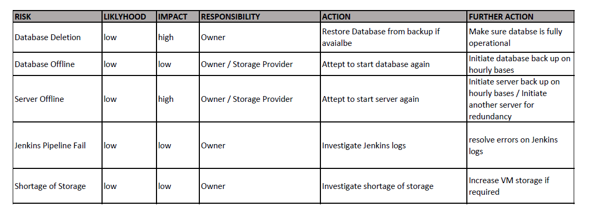

## Outstanding Issues

- Docker Swarm Manager and Worker nodes have already have dependencies preinstalled therefor if deployed on entirely new environment sometimes deploying application can leed to unwanted results.
- In some cases Ansible skipping removing unused images on worker node. 

## Future Improvements

- Adding some CSS would make application more eye catching.
- More rigorous testing would serve beneficial for overall health of application. 
- Reconfiguration of Ansible would be advisable to make sure it fully support ``` docker system prune ``` for worker node.

## Retrospective

Overall project is fully functional however to expand on above issues and improvements more could be done for the project. I've particularly got fond of Docker and think it is fantastic tool which greatly helps deploy applications stress free and in fast manner. Had some issues at the beginning while working on different machines which caused some headache trying to get all tools work with each other as they should. Configuration was handled by Ansible and 99% its all working, though some improvements could be done. It can get complicated to keep track of each step overall configuration therefor some sort UI would be great to have. All tools were used for this project follow logical sequence of instructions given in their respective configuration files and if something working not as intended or not at all, it is more then likely logical mistake made by myself. Ansible can be sometimes confusing therefor some additional training would serve beneficial.

## Author

#### Tadas Bytautas - QA DevOps and Cloud Consultant